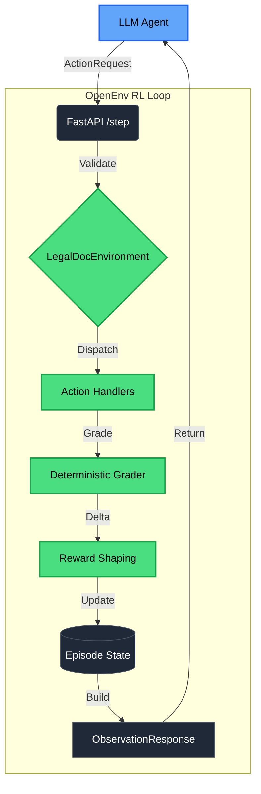

# ⚖️ LexCrisis: Multi-Dimensional Legal Crisis Management

**OpenEnv-compliant reinforcement learning environment** for the **Meta PyTorch Hackathon 2026**.

LexCrisis simulates the single most complex scenario in legal practice: managing a **multi-party pharmaceutical product liability crisis** where an AI agent must simultaneously reason about **conflict of interest** (BCI Rules 22, 33), **attorney-client privilege** (IEA Sections 126, 129), **evidence preservation** (CPC Order XI), and **adversarial litigation tactics** — all under real legal rules with cascading consequences.

---

## 🚀 Quick Start

### 1. Environment Variables
```bash
export API_BASE_URL=https://router.huggingface.co/v1   # OpenAI-compatible endpoint
export MODEL_NAME=Qwen/Qwen2.5-72B-Instruct            # Model identifier
export HF_TOKEN=your_token_here                         # API key
```

### 2. Start the Environment
```bash
pip install -r requirements.txt
uvicorn server.app:app --host 0.0.0.0 --port 7860
```

### 3. Run Baseline Inference
```bash
python inference.py
```

### 4. Deploy to Hugging Face Spaces
```bash
git push hf main
```

---

## 🏗️ Architecture



```text
lexcrisis/
├── openenv.yaml           # Metadata, schemas, task registry
├── server/
│   ├── app.py             # FastAPI endpoints (reset/step/state/health)
│   ├── environment.py     # State management, reward shaping, action dispatch
│   ├── models.py          # Pydantic: Action, Observation, State responses
│   ├── scenarios.py       # Legal data: clients, documents, crisis events (with ground truth)
│   ├── tasks.py           # Task definitions + deterministic graders
│   └── ui.html            # Premium dark-theme RL trajectory viewer
├── inference.py           # Baseline agent (OpenAI Client)
├── Dockerfile             # HF Spaces container
├── requirements.txt       # Dependencies
└── README.md
```

---

## 🎯 Tasks (3 Tasks: Easy → Hard)

| Task | Objective | Difficulty | Max Steps | Legal Framework |
|------|-----------|------------|-----------|-----------------|
| `task_1` | Client Conflict Screening | Easy | 15 | BCI Rules 22, 33 |
| `task_2` | Privileged Document Review & Classification | Medium | 25 | IEA Sections 126, 129, Crime-Fraud Exception |
| `task_3` | Multi-Front Crisis Triage | Hard | 40 | CPC Order XI, IEA Section 45, BCI Rule 33 |

### Why Each Task Is Genuinely Hard

- **Task 1 (Easy):** 6 clients with 5 conflict pairs. Requires understanding BCI Rules distinguishing between opposing parties and acting against former clients — a subtlety most LLMs struggle with.

- **Task 2 (Medium):** 8 documents spanning attorney-client privilege, work product, dual protection, unprivileged business communications, crime-fraud waiver, and at-issue waiver. The agent must apply *IEA Section 126* (professional communications) and *IEA Section 129* (confidential communications) correctly — not just pattern-match keywords.

- **Task 3 (Hard):** 5 simultaneous crisis events with **real deadlines**, **2 adversarial traps** (discovery requests designed to waive privilege), and **1 ethical trap** (former client conflict where the "obvious" action violates BCI Rule 33). Cascading consequences: missed litigation hold → spoliation sanctions; falling for privilege trap → waiver of ALL related communications.

### What Makes This Novel (vs. All Existing Benchmarks)

| Dimension | LexGLUE / CUAD / ContractNLI / LegalBench | LexCrisis |
|-----------|:---:|:---:|
| Sequential stateful decisions | ✗ | ✓ |
| Irreversible cascading consequences | ✗ | ✓ |
| Ethical constraint reasoning (BCI Rules) | ✗ | ✓ |
| Adversarial information / traps | ✗ | ✓ |
| Multi-stakeholder conflict analysis | ✗ | ✓ |
| Dense grader-delta reward shaping | ✗ | ✓ |

---

## 📋 Action Space (20 Actions Across 3 Tasks)

**Task 1 — Conflict Screening:**
- `review_client(client_id)` — Read client intake record
- `check_conflict(client_a, client_b)` — Check conflict of interest
- `cite_rule(client_a, client_b, rule)` — Cite BCI rule (e.g., "BCI Rule 33")
- `accept_client(client_id, justification)` — Accept for representation
- `decline_client(client_id, reason)` — Decline representation
- `submit_intake()` — Finalize decisions

**Task 2 — Privilege Review:**
- `review_document(doc_id)` — Read document content
- `classify_privilege(doc_id, classification, doctrine)` — Classify: attorney_client / work_product / both / none / waived
- `identify_waiver(doc_id, waiver_type, explanation)` — Flag waiver event
- `identify_exception(doc_id, exception_type, explanation)` — Flag crime-fraud / at-issue exception
- `recommend_action(doc_id, action, reasoning)` — Recommend: withhold / produce / clawback / redact
- `submit_review()` — Finalize review

**Task 3 — Crisis Triage:**
- `review_event(event_id)` — Read crisis event
- `issue_litigation_hold(scope, custodians)` — Issue preservation notice (CPC Order XI)
- `file_motion(motion_type, court, arguments)` — File Injunction opposition / Transfer Petition
- `respond_discovery(request_id, response_type, objections)` — Respond to discovery
- `assess_expert(expert_id, qualification)` — Evaluate expert under IEA Section 45
- `flag_adversarial(item_id, threat_type, explanation)` — Flag adversarial tactic
- `flag_ethical_issue(issue_type, affected_clients, resolution)` — Flag ethical dilemma
- `submit_triage()` — Finalize triage report

---

## 📊 Reward Function

```
reward = (new_grader_score - old_grader_score) + step_penalty
```

| Trigger | Penalty | Rationale |
|---------|---------|-----------|
| Correct conflict / privilege / deadline | +grader_delta | Progress toward task completion |
| Invalid action | −0.05 | Structural failure |
| Incorrect finding | −0.03 | Penalize false positives |
| Ethical violation | −0.10 | Cascading consequence |
| Missed deadline | −0.08 | Spoliation / procedural failure |
| Missing parameters | −0.02 | Incomplete action |

---

## 📊 Grader Design (100% Deterministic)

| Task | Component | Weight | Metric |
|------|-----------|--------|--------|
| 1 | Conflict pair identification | 0.40 | F1 score |
| 1 | Accept/decline accuracy | 0.35 | Accuracy |
| 1 | BCI rule citation accuracy | 0.25 | Accuracy |
| 2 | Privilege classification accuracy | 0.45 | Accuracy (partial credit) |
| 2 | Waiver event identification | 0.30 | F1 score |
| 2 | Doctrine citation quality | 0.25 | Keyword overlap |
| 3 | Deadline compliance | 0.25 | Step-threshold binary |
| 3 | Ethical compliance | 0.25 | F1 + resolution quality |
| 3 | Adversarial detection | 0.25 | F1 score |
| 3 | Action sequence quality | 0.25 | Ordering + coverage |

---

## 📖 Legal Citations (All Real and Verifiable)

- **BCI Rule 22** — Prohibits advising opposite party.
- **BCI Rule 33** — Prohibits acting against former client.
- **CPC Order XI** — Discovery and Inspection of Documents.
- **CPC Section 25** — Power of Supreme Court to transfer suits.
- **IEA Section 45** — Opinions of experts.
- **IEA Section 126** — Protection of professional communications with advocates.
- **IEA Section 129** — Confidential communications with legal advisers.

---

## 🏆 Competition Scoring Alignment

| Category (Weight) | How LexCrisis Maximizes |
|:---|:---|
| **Real-world Utility (30%)** | Directly models crisis litigation workflow — conflict screening, privilege review, and multi-front triage are daily tasks at every top law firm in India |
| **Task & Grader Quality (25%)** | 3 tasks with deterministic F1/accuracy graders; Hard task with adversarial traps genuinely challenges frontier models |
| **Environment Design (20%)** | Cascading consequences, dense grader-delta rewards, proper episode boundaries, typed Pydantic models |
| **Code Quality & Compliance (15%)** | Full OpenEnv spec, typed endpoints, clean architecture, comprehensive error handling |
| **Creativity & Novelty (10%)** | First-ever environment testing conflict-of-interest reasoning, privilege classification, and crisis triage under adversarial pressure with real BCI / IEA rules |

---

## 📄 License
MIT 2026 LexCrisis Team.

<!-- BUILD_TIME: 2026-04-02 04:39:03 -->
